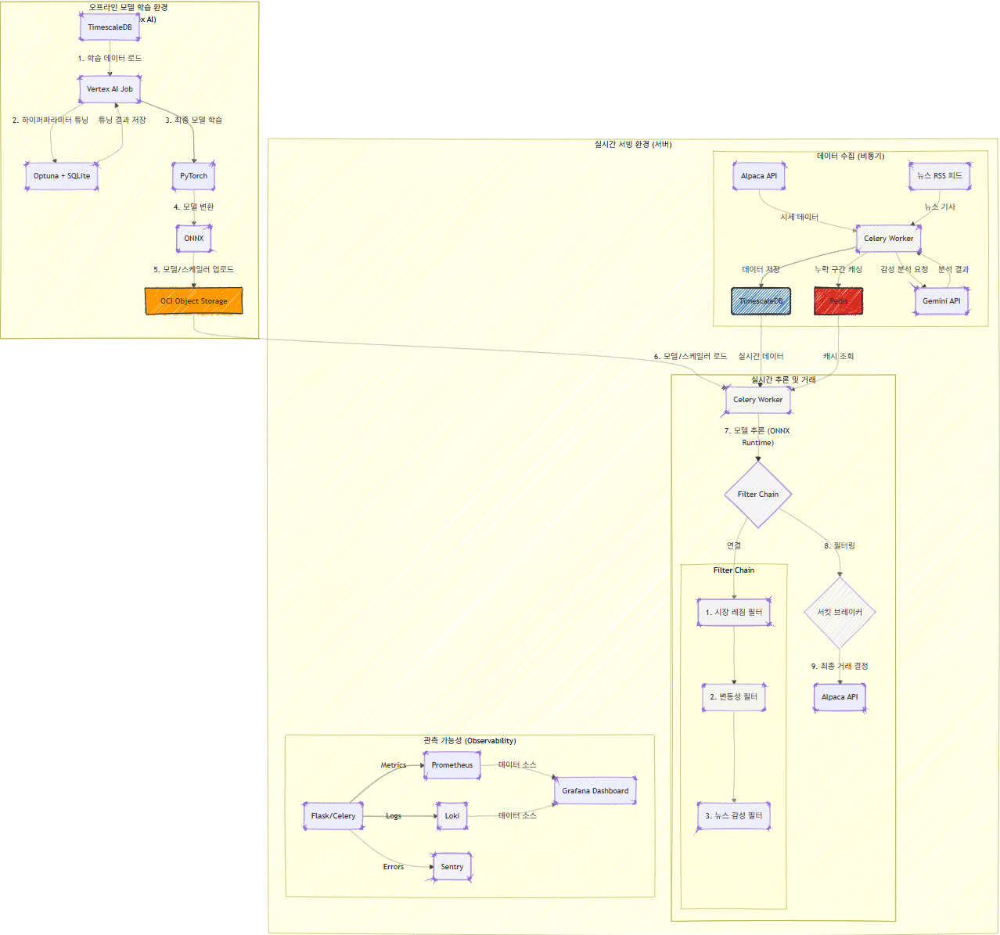

# FlaskCryptoTrader

FlaskCryptoTrader는 시계열 기반 딥러닝 모델과 MLOps 파이프라인을 결합한 실시간 암호화폐 자동매매 시스템입니다. 데이터 수집, 전처리, 모델 학습 및 하이퍼파라미터 튜닝, ONNX 변환, 아티팩트 저장, 실시간 추론과 주문 실행까지 전체 과정을 자동화하고 운영 가능한 형태로 제공합니다.

---

## 핵심 기능 요약

- 시계열 데이터 기반의 정교한 피처 엔지니어링 및 시퀀스 생성
- LSTM, Transformer, PatchTST, TCN 등 여러 딥러닝 아키텍처 실험 및 학습
- Optuna를 이용한 프로덕션급 하이퍼파라미터 튜닝 및 MedianPruner 적용으로 탐색 시간 대폭 단축
- 학습된 PyTorch 모델을 ONNX로 변환하여 경량 서빙 환경에서 추론
- OCI Object Storage에 모델 아티팩트 저장 및 서버와 연동된 자동 배포
- TimescaleDB 기반의 시계열 저장소 적용 및 쿼리/쓰기 성능 최적화
- Celery 기반의 비동기 데이터 수집, 감성 분석, 모델 추론 파이프라인
- Gemini API 기반의 뉴스 감성 분석 통합 및 실시간 필터링
- 다단계 필터 체인(레짐, 변동성, 뉴스 감성)과 서킷 브레이커로 거래 안전장치 구현
- Prometheus, Grafana, Loki, Sentry를 통한 통합 관측 및 알림

---

## 아키텍처 개요

시스템은 크게 두 영역으로 구성됩니다.

1. 오프라인 학습 파이프라인 (Vertex AI 기반)
   - TimescaleDB에서 학습용 시계열 데이터 수집
   - Optuna 기반 하이퍼파라미터 탐색 및 Walk-Forward 검증
   - PyTorch로 모델 학습, ONNX로 변환
   - ONNX 모델 및 스케일러를 OCI Object Storage에 업로드

2. 실시간 서빙 및 거래 엔진 (서버)
   - Celery로 시세 및 뉴스 비동기 수집
   - 수집된 뉴스는 Gemini API로 감성 점수화
   - TimescaleDB에 저장, Redis로 누락 구간 캐시
   - ONNX Runtime으로 실시간 추론
   - 예측 결과는 필터 체인과 서킷 브레이커를 통과한 뒤 주문 실행
   - Prometheus, Grafana, Loki, Sentry로 모니터링 및 로그 집계

---

## 주요 설계 및 개선 사항

### TimescaleDB 및 스키마 최적화
- 기존의 auto_increment PK와 과도한 인덱스를 제거하고, 시계열 특성에 맞추어 `(timestamp, timeframe, symbol)` 형태의 복합 기본 키를 도입했습니다.
- 불필요한 인덱스를 제거하여 쓰기 성능을 개선했고, 읽기 쿼리는 TimescaleDB의 시계열 파티셔닝 및 압축 기능을 활용하도록 설계했습니다.
- 이로 인해 데이터 적재와 시계열 조회의 성능과 확장성이 향상되었습니다.

### 데이터 무결성 및 멱등성
- 대용량 Bulk Insert 시 `ON CONFLICT DO NOTHING`를 활용하여 중복 삽입을 방지하고 멱등성을 보장합니다.
- Celery 작업이 네트워크 오류로 재시도되더라도 데이터 중복 없이 안전하게 작동합니다.

### 지능형 캐싱
- 데이터 누락 구간을 검출하면 해당 구간 정보를 Redis에 캐시하여 동일 구간에 대한 불필요한 API 호출을 차단합니다.
- 캐시 정책으로 비용 절감과 안정성 향상을 동시에 달성했습니다.

### 뉴스 감성 통합
- Celery 작업으로 주요 뉴스 피드(RSS 등)를 주기적으로 수집합니다.
- 수집된 문서는 Gemini API로 감성 점수를 산출하여, 모델 학습용 피처와 실시간 거래의 필터로 활용합니다.
- 감성 점수는 시장 심리의 미묘한 변화를 반영하는 피처로 사용되며, 거래 실행 시에는 모델 신호와 감성이 크게 엇갈릴 경우 거래를 보류하는 안전장치로 작동합니다.

### 하이퍼파라미터 튜닝 및 검증
- Optuna를 사용하여 각 모델 타입별 탐색 공간을 구성했습니다.
- Walk-Forward 교차검증을 기본으로 적용하여 시계열의 시간 의존성을 고려한 신뢰 가능한 평가를 실시합니다.
- MedianPruner 적용으로 유망하지 않은 실험을 조기에 중단하여 전체 탐색 시간을 평균 60% 이상 단축했습니다.
- 탐색 상태와 결과는 SQLite에 저장하여 중단/재개가 가능합니다.

### 서빙 안정성 및 관측 가능성
- 다단계 필터 체인(시장 레짐, 변동성, 뉴스 감성)과 일일 손실 한도를 감시하는 서킷 브레이커로 운영 리스크를 줄였습니다.
- Prometheus를 통해 핵심 메트릭(모델 예측 분포, 작업 큐 깊이, API 호출 빈도 등)을 계측하고 Grafana에서 시각화합니다.
- Loki로 구조화된 로그를 수집하고 Sentry로 예외를 추적합니다.

---

## 코드 구조(주요 디렉토리)

- `app/` : 백엔드 API, Celery 태스크, DB 모델, 서빙 관련 코드
- `vertex/` : 학습/튜닝 파이프라인(데이터 파이프라인, 모델 정의, 튜너, ONNX Exporter 등)
- `Dockerfile` : 컨테이너 이미지 빌드 설정
- `requirements.txt`, `vertex/requirements.txt` : 의존성 목록

---

## 모니터링 및 알림

- Prometheus: 시스템 메트릭과 커스텀 메트릭 수집
- Grafana: 대시보드에서 실시간 모니터링, 알람 설정
- Loki: 애플리케이션 로그 수집 및 쿼리
- Sentry: 런타임 예외 및 에러 알림

---
